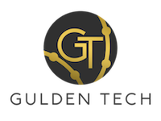

# Welcome Developers!

GuldenTech: A one stop shop for your **Platform As A Service** needs.

Welcome to the GuldenTech developer guide. Here we will outline information needed to build and deploy your apps on guldentech infrastructure.

## GuldenTech Stack

| Logo | App | Purpose | Version | 
| --- | --- | --- | --- |
|  | [Rancher](https://rancher.dropbear-eel.ts.net/) | K8s Console | 2.10.3 |
|  | [Harbor](https://harbor.guldentech.com/) | Container Registry | 2.11.1 |
|  | [Uptime Kuma](https://kuma.guldentech.com/) | Monitoring Tool | 1 |
|  | [K3s](https://k3s.io) | Lightweight Kubernetes | v1.30.14 |

## The Platform

GuldenTech is 100% ran on kubernetes. If you are not familiar with kubernetes there may be a little bit of a learning curve, but we provide an easy to navigate web console that sits on top of kubernetes to help you quickly navigate through your workloads and resources.

The platform sitting on top of kubernetes is Rancher.

## Onboarding

To gain access to GuldenTech and be able to deploy applications, please email [guldentechjobs@gmail.com](mailto:guldentechjobs@gmail.com) and provide the following information.

* First name
* Last name
* Will you be using our container registry Harbor?
    * If yes, please provide a password to use in the email

Someone from GuldenTech will reach out and talk about your use case and see if it fits on GuldenTech.

