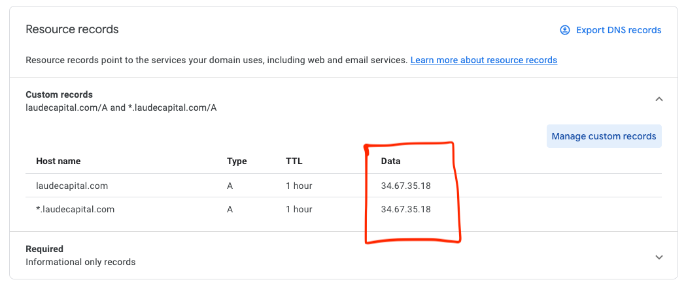

# Ingress to your application

If you would like to expose your application to outside the cluser, you will need to create an ingress and service resource and tie it to a domain name.

## Update your DNS to point to guldentech infra node

Example domain provider needed configuration for non guldentech.com domains.

!> New ip: 137.220.60.21

ß

## Ingress

Apply the following resource to your namespace. This in return will expose your service to the outside world. It will force SSL for any connection.

Below is an example:
```yaml
apiVersion: networking.k8s.io/v1
kind: Ingress
metadata:
  annotations:
    ingress.kubernetes.io/ssl-redirect: "true"
    traefik.ingress.kubernetes.io/router.middlewares: default-redirect-https@kubernetescrd
    cert-manager.io/cluster-issuer: letsencrypt-prod
  name: {your_site}-ingress
  namespace: {FILL_ME_IN}
spec:
  rules:
  - host: {your_site}.com
    http:
      paths:
      - backend:
          service:
            name: {FILL_ME_IN}
            port:
              number: {FILL_ME_IN}
        path: /
        pathType: ImplementationSpecific
  tls:
  - hosts:
    - {your_site}.com
    secretName: {your_site}.com
```

Also this will create a secret containing your TLS keys. Make sure your domain is pointing to guldentech IPs or this will fail.