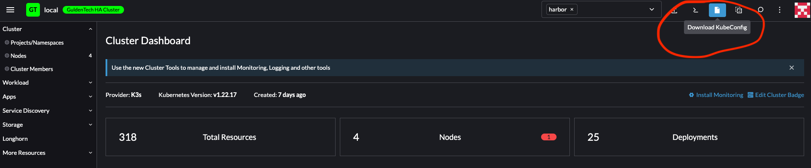

# Rancher

What is Rancher? Rancher is a web interface allowing for easy interaction with kubernete's resources. Each user will have their own Rancher project. In your project you can create kubernetes namespaces.

## Post Onboarding

After you onboard, you will be able to access the Rancher console or access the cluster using kubectl. To gain access to a cluster using kubectl, log into Rancher and navigate to the cluster you want access to via kubectl. Once you are at the page that shows below, click the Kubeconfig file and follow the instructions it prompts.

!> Modify the kubectl config file rancher provides to remove `certificate-authority-data: "LS0tLS1C.."` and its value and replace it with: `insecure-skip-tls-verify: true`

!> You must be a member of the [guldentech github org](https://github.com/guldentech)

## Create a namespace!

Dont forget to create a namespaces on the Rancher console for your project.
